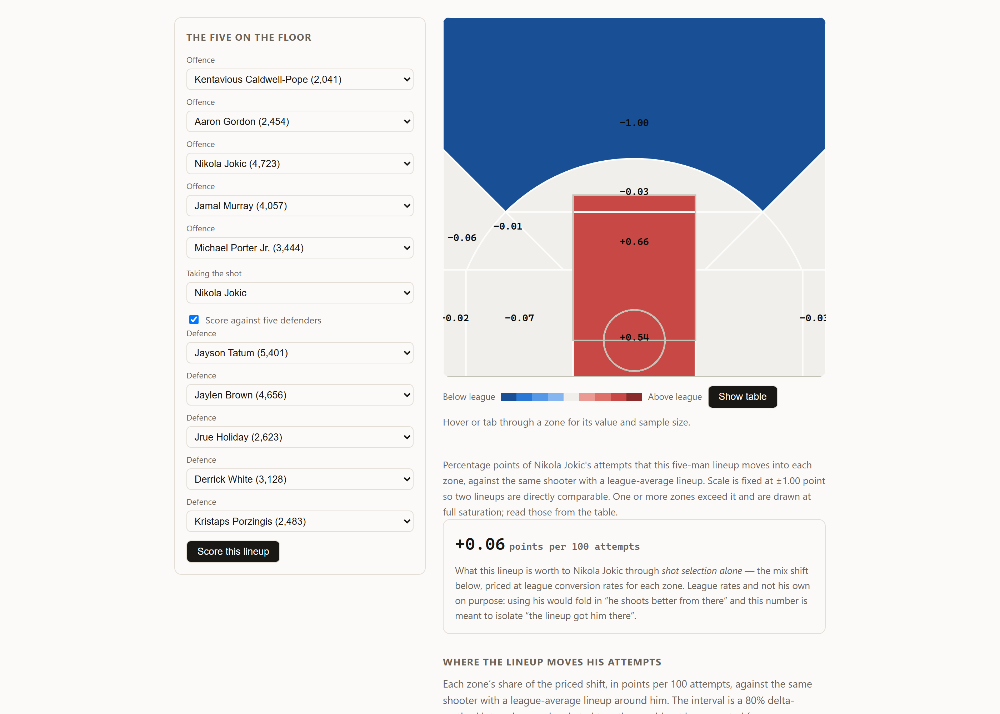
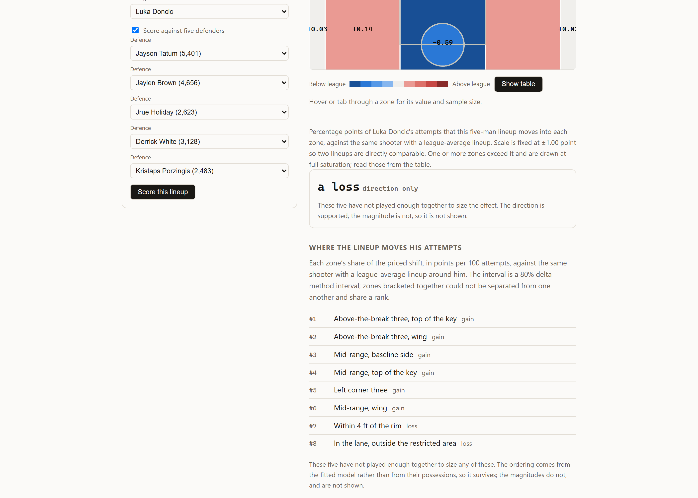
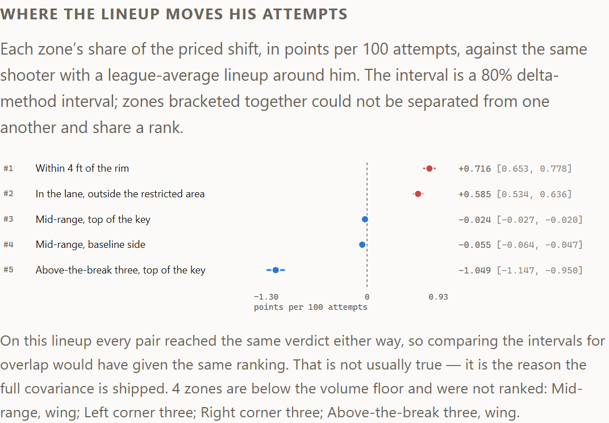
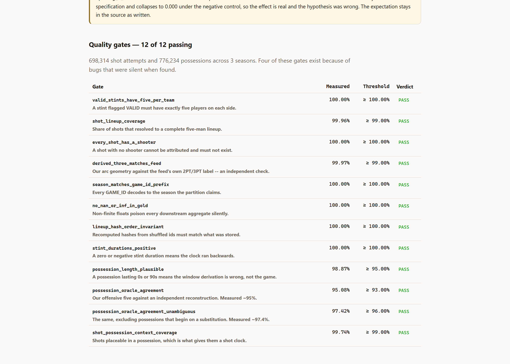
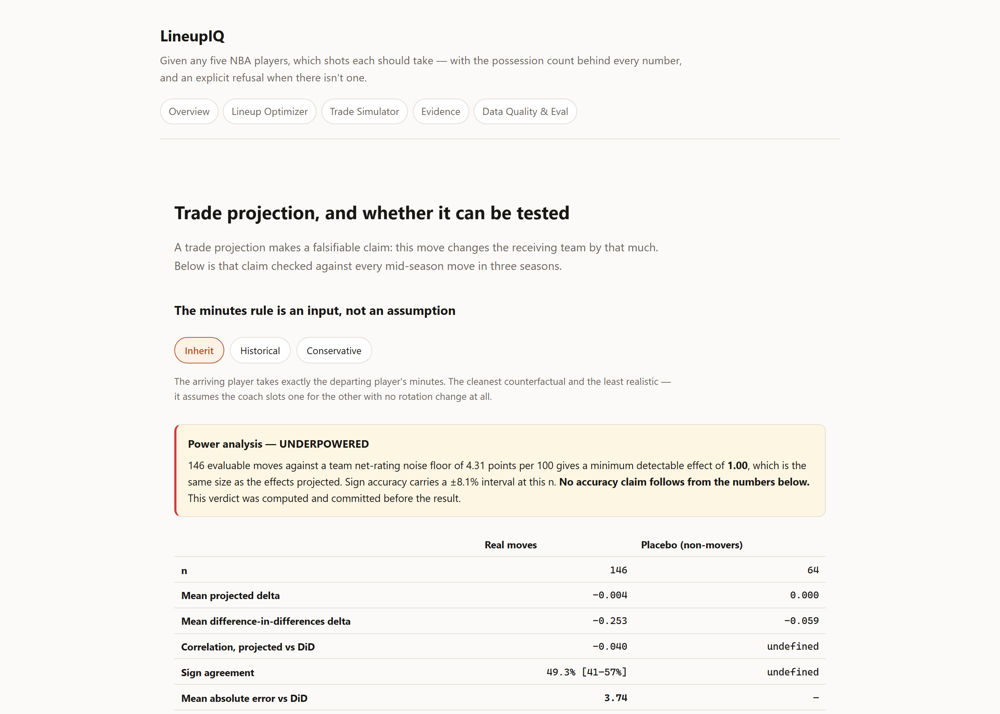

# LineupIQ

**Given any five NBA players — including five who have never shared a floor — which shots
each should take, with the possession count behind every number and an explicit refusal
when there isn't one.**

[](https://github.com/darthmanwe/LineupIQ/actions/workflows/ci.yml)
[](https://github.com/darthmanwe/LineupIQ/actions/workflows/repro.yml)
[](LICENSE)



Three seasons of NBA play-by-play, reconstructed into who was on the floor for every one of
698,314 shots, then modelled two ways: *does he make it* and *which shot does he take*.
The second turns out to be the interesting question. Pick any five players and the answer
is computed live, in a Cloudflare Worker, from a closed form that agrees with the Python
fit to 1e-9.

---

## The finding

**Lineup context does almost nothing to whether a shot goes in, and something real, small
and directional to which shot gets taken — in the opposite direction from what was
pre-registered.**

<!-- lineupiq:begin id=results.headline -->
| Question | Target | What lineup context adds |
| --- | --- | --- |
| Does he make it? | `P(make \| shooter, zone, lineup)` | **+0.02%** log loss |
| Which shot does he take? | `P(zone \| shooter, lineup, context)` | **+0.08%** log loss |

The pre-registered `spacing_x_three` term was expected **positive** and fitted at **-0.474**, standard error 0.045, z = -10.5.
<!-- lineupiq:end id=results.headline -->

Both measured on **leave-lineup-out**: held-out five-man combinations whose five players
were each seen in training. Measuring conversion and concluding "lineups don't matter"
answers the wrong question well. Spacing does not make a player a better corner shooter; it
gets him *a corner three instead of a contested pull-up*.

And the term that was supposed to prove it came out backwards — more shooting around you,
more threes for you, is what the sign was registered for. That is not noise at this
standard error; it is a decisive contradiction of the stated expectation, and it survives a
within-shooter refit that removes all between-player variation. The reading is that the
model recovers *role*, not *space*: put a shooter beside four other shooters and someone
has to operate inside.

The pre-registered expectation stays in the source, as written, next to the coefficient
that contradicts it.

**And it is small.** Priced across thousands of random lineups, the whole shot-mix shift is
worth a standard deviation of **under 0.2 points per 100 attempts** — the table further down
is generated from the run log. Every coefficient in the model is overwhelmingly significant,
the smallest |z| being about 4, and the effect is economically negligible. Those are the same fact from two sides,
and reporting the first without the second is how a real result becomes an overclaim.

---

## Where the evidence runs out

The project's organising constraint is not modelling. It is that **99% of NBA five-man
lineups have never played enough to support a point estimate.**

<table>
<tr>
<td width="50%">

A lineup's offensive rating has a standard error of about `115/√n` per 100 possessions.
At 200 possessions that is ±8 — against a true spread between good and bad lineups of
roughly 6–8. Below that floor the measurement is noisier than the entire signal.

So the API refuses. Not a small number with a wide interval and a footnote: a
`422 INSUFFICIENT_SUPPORT` carrying how many possessions exist, how many are needed, which
players fall short, and what would change the answer.

Between "refuse" and "answer" there is a third state, and it is the normal one for a
counterfactual: the player terms have support and the five-man combination does not. That
returns `200` with **the direction and no digits**.

</td>
<td width="50%">



</td>
</tr>
</table>

<!-- lineupiq:begin id=results.estimability -->
| | Value |
|---|---|
| Distinct five-man offensive lineups | 49,827 |
| Median possessions per lineup | 7 |
| Lineups clearing the 200-possession reporting floor | 485 (1.0%) |
| Lineups above 500 possessions | 129 (0.3%) |
| Share of played time covered by reportable lineups | 50.4% |

At the 200-possession floor a lineup's offensive rating carries a standard error
of roughly +/-8 per 100 possessions, against a true between-lineup spread of about 6-8.
So **99.0% of lineups cannot support a point estimate at all** -- which
is why the refusal contract is a feature of the API rather than an error path.
<!-- lineupiq:end id=results.estimability -->

The thresholds are **pre-registered and hash-pinned**. CI asserts the file has not changed,
so loosening a floor to make a demo look better is a build failure rather than a judgement
call.

Two things follow, and they shape the whole project. A single lineup's observed rating is
**not a target a model can be scored against** — validation has to pool across lineups, or
move down to the shot level where Bernoulli observations are plentiful. And the headline
product claim is **counterfactual by construction**: forecasting a trade means predicting
lineups that have never existed, which no calibration curve on lineups that have can
validate.

---

## Ranking without overclaiming



`/lineups/optimal-plays` splits the priced shift by zone and ranks it. Sorting nine numbers
is trivial; the difficulty is that **a sorted list reads as a claim that the first beats the
second**, and at this effect size most of those claims are not supported.

So every pair is tested before the list is served as an ordering — and the test is on the
*difference*, not on whether two intervals overlap. Zone shares come out of a softmax and
sum to one, so two contributions are strongly negatively correlated and `Var(a − b)` is far
smaller than `Var(a) + Var(b)`. Comparing marginal intervals drops that term and refuses to
rank pairs the model can order perfectly well. **7.4% of ranked pairs separate on the
difference and would have been declined by the cheaper test** — which is why a 20×20
covariance matrix ships to the edge instead of twenty standard errors.

Zones the data cannot separate share a rank. When nothing separates, the response says
`ordered: false` and the page renders an unordered set.

---

## Tech stack

| Layer | Choice | Why this one |
| --- | --- | --- |
| **Modelling** | Python 3.11–3.13, polars, numpy, scipy, scikit-learn, LightGBM | polars for the possession-grain joins; the served model is hand-written so it can be mirrored in TypeScript |
| **Served model** | Conditional logit — closed form, 9 dot products and a softmax | A GBDT cannot run in 10 ms of Worker CPU, and `C(450,5) = 1.5×10¹¹` means nothing can be precomputed |
| **API** | Hono on Cloudflare Workers, TypeScript strict + `noUncheckedIndexedAccess` | Always-on free tier, no cold-start sleep, one deploy for API and site |
| **Web** | Next.js 16 static export, hand-written SVG charts, no chart library | Served as static assets by the same Worker; charts are ~200 lines and encode the uncertainty rules directly |
| **Data** | Committed Parquet gold layer (31 MB) with checksummed contracts | A clean clone reproduces every published number offline — no API key, no network, no account |
| **Tooling** | uv, ruff, mypy `disallow_untyped_defs`, ESLint, Prettier, vitest in `workerd` | The TypeScript tests run in the actual Workers runtime, not in Node |
| **CI** | 14 jobs on GitHub Actions — 21 with the OS × version matrix, Windows × Linux, Python 3.11–3.13, Node 22/24 | Offline and free by default; a separate workflow refits both models and asserts every metric reproduces |
| **Optional** | Snowflake DDL generated from the same table registry, `sqlfluff`-linted | Entirely off the demo path — real, versioned, and honest about what was executed |

**Scale:** ~19,700 lines of Python and TypeScript, ~5,300 lines of tests, 341 tests
(237 Python, 104 in `workerd`), 16 live endpoints.

---

## What the engineering had to solve

<!-- lineupiq:begin id=results.dataquality -->
| | Value |
|---|---|
| Seasons | 2022-23, 2023-24, 2024-25 |
| Shot attempts | 698,314 |
| Resolved to a complete five-man lineup | 698,006 (99.96%) |
| Lineup solved cleanly (training-grade) | 672,772 (96.34%) |
| Stints reconstructed | 117,766 |
<!-- lineupiq:end id=results.dataquality -->

**Nobody records who is on the floor.** Play-by-play gives substitutions and who did things;
the five-man lineup for every event has to be replayed forward from a starting five that is
never stated. Two details carry most of the accuracy, and both are counterintuitive:

- **`EVENTNUM` is not chronological.** Sorting by it produces hundreds of impossible states
  per season — players shooting while off the floor. Sorting by the game clock cut invariant
  violations by ~91%.
- **Events tied on the clock must be evaluated tolerantly.** A player very often fouls and
  is substituted on the same tick, and insisting on one order rejects the true starting
  five. That single detail moved exact solves from 39% to 98%.

The result is validated against **box-score minutes** — the one genuinely independent check
available, because the box score comes from a different system and minutes played is a
physical quantity. Derived minutes land within about a second per player-game across
~84,000 player-games, and a player the box score says did not play must derive exactly zero.

**Possession end times are outcome-contaminated.** A possession ends on a made shot at the
shot, and on a miss at the rebound a beat later. So "how long did this possession last" leaks
the outcome: shots that end their possession convert at **93.3%** against **1.3%** for shots
that do not. Both columns are attached for reporting and both are in `FORBIDDEN_FEATURES`,
and the design matrix is narrowed to a whitelist before anything is computed — so they cannot
be read by accident rather than merely by discipline.

**Six reproducibility bugs, all the same shape.** Ordering that looked deterministic because
it was seeded. A `group_by` makes no ordering promise; `np.argsort` defaults to an unstable
sort; reciprocal rank fusion produces exact ties constantly. Each one made a published number
depend on the machine's core count. The most recent moved a placebo sample from 64 to 66
between two runs on the same machine — a seeded draw over an unordered population is not
reproducibility, and `git diff` had never noticed because the committed baseline happened to
match the machine that wrote it.

---

## What it does

Pick any five players. LineupIQ estimates what each should shoot and from where, given who
else is on the floor, then projects how a trade changes it.

| Page                    | What it answers                                                                                                     |
| ----------------------- | ------------------------------------------------------------------------------------------------------------------- |
| **Lineup Optimizer**    | **Live:** the shot-value surface by zone, plus a picker — choose any five players and see how that lineup moves a shooter's attempts between zones. Refusals render as refusals. |
| **Trade Simulator**     | **Live:** the backtest under three minutes rules, with its underpowered verdict stated before its numbers.           |
| **Evidence / Comps**    | Free-text search over historical lineup documents, with a retriever toggle and published retrieval metrics.          |
| **Data Quality & Eval** | **Live:** all 12 gates with thresholds and verdicts, the selection ladder, RAPM reliability, and groundedness with both distractor controls. |

What the closed-form serving constraint costs in log loss against the unconstrained
gradient-boosted fit is measured and published in the results below, rather than absorbed
silently.

| | |
| --- | --- |
|  |  |
| Every data-quality gate with its threshold and verdict. | The endpoint that refuses to exist, and publishes why. |

## The possession layer, and why it exists

The negative result above is a **target mismatch**, not a modelling failure. Spacing does
not make a player shoot better from the corner; it gets him more open corner threes instead
of contested mid-range. Lineup effects live in shot *selection* and in what a possession is
worth — not in conversion once a shot is taken. Measuring conversion and concluding "lineups
don't matter" answers the wrong question well.

So the foundation was rebuilt at possession grain, which is where those effects can actually
be measured and what any trade projection has to rest on:

<!-- lineupiq:begin id=results.possessions -->
| | Value |
|---|---|
| Possessions | 776,234 |
| Attributed to a five-man lineup | 100.00% |
| Agreement with the independent lineup oracle | 95.08% |
| ... restricted to possessions not starting on a substitution | **97.42%** |
| Possessions starting on a substitution (attribution ambiguous) | 9.0% |
| Mean possession length | 14.65s |
| Median possession length | 14.0s |
| Points per possession, transition | 1.490 |
| Points per possession, half-court | 1.095 |

The oracle is a second lineup reconstruction, written independently in
another language. Away from substitution boundaries the two agree at the
same rate our period-start solver reports exact solutions. About one
possession in eleven begins on the exact second of a substitution, where
there are two defensible answers and no way to choose between them; those
are flagged in the data rather than silently trusted.

Possession length is derived, not a column in the feed, which makes it
worth checking against something already known: the NBA has averaged
close to 14 seconds a possession for years. That check is what caught a
real bug here -- the feed's own start and end fields are the clock at a
possession's first and last *recorded event*, so 45% of possessions
measured as zero seconds long and the published transition split was
computed on a duration that was not a duration.

**Points per possession by how the possession began.** Duration is partly
decided by the outcome: a make ends a possession at the shot, a miss at
the rebound a beat later, so short possessions over-collect makes and the
transition figure above is biased upward. Start type is fixed before the
offence does anything and cannot be contaminated that way, so it is
published beside it.

| Possession start | n | PPP |
|---|---|---|
| OffLiveBallTurnover | 58,656 | 1.326 |
| OffMissedShot | 251,759 | 1.172 |
| OffMadeShot | 349,993 | 1.126 |
| OffDeadball | 77,631 | 1.122 |
| OffTimeout | 38,195 | 1.088 |

A steal is the most valuable way to get the ball and a timeout the least,
with about a quarter of a point per possession between them. Nothing in
the pipeline was fitted to produce that ordering.
<!-- lineupiq:end id=results.possessions -->

## The refusal contract, exactly

Two distinct mechanisms, and the API is exact about which fires when:

- **`422 INSUFFICIENT_SUPPORT`** — the claim itself has no basis. A problem document, never
  a 200. It carries the possession count, the threshold, _which_ players fall short, and
  what would help. "Not enough data" without "of what" is not an answer.
- **`200` with `tier: "directional"` and a null point estimate** — the player-level terms
  have support but the lineup-interaction term does not. This is the normal case for a
  post-trade lineup. The direction survives; the magnitude, and its interval, do not.

Never a 200 with a confident number and a footnote. The rule is enforced by a **sweep**, not
by examples: a test walks every low-support lineup in the parity fixture through every live
scoring route, and it fails the build the moment a new `POST` route appears in the registry
that it does not know how to gate. Forgetting to gate a new endpoint is the natural
mistake — the route works, the numbers look plausible, and nothing raises.

Thresholds live in
[`support_thresholds.json`](services/ml/src/lineupiq/configs/support_thresholds.json),
hash-pinned _before_ any lineup-level result was computed.

Some things are refused permanently rather than pending. `/api/leaderboards/gravity`
returns `410 METRIC_WITHDRAWN`: gravity needs player-tracking data, this project uses
public play-by-play, and no amount of further work here produces it. `410` rather than
`501` is the point — a client that sees it should stop asking.

## Results

Every number below is rendered from a run log by `lineupiq report render`, and CI fails if
a committed block is stale. Nothing here is typed by hand, and the verdict column is
allowed to say _loses_.

<!-- lineupiq:begin id=results.model -->
**Leave-lineup-out -- unseen five-man combinations** -- n = 406,723 shots

| Model | Log loss | Brier | Resolution | ECE | Cal. slope | Verdict |
|---|---|---|---|---|---|---|
| B0 - league zone mean | 0.66036 | 0.23385 | 0.01566 | 0.0106 | 0.991 |  |
| B1 - shooter x zone (shrunk) | 0.65780 | 0.23267 | 0.01705 | 0.0104 | 0.972 |  |
| B2 - B1 + context, no lineup | 0.65692 | 0.23230 | 0.01734 | 0.0107 | 0.943 |  |
| B3 - additive GBDT, no lineup | 0.65242 | 0.23031 | 0.01951 | 0.0143 | 0.928 |  |
| **full - served closed form** | 0.65681 | 0.23224 | 0.01739 | 0.0106 | 0.941 | +0.018% vs B2 |
| **full - unconstrained GBDT** | 0.65202 | 0.23014 | 0.01963 | 0.0141 | 0.932 | +0.061% vs B3 |

**Walk-forward -- later games** -- n = 404,712 shots

| Model | Log loss | Brier | Resolution | ECE | Cal. slope | Verdict |
|---|---|---|---|---|---|---|
| B0 - league zone mean | 0.65895 | 0.23316 | 0.01556 | 0.0061 | 1.000 |  |
| B1 - shooter x zone (shrunk) | 0.65712 | 0.23231 | 0.01679 | 0.0088 | 0.976 |  |
| B2 - B1 + context, no lineup | 0.65608 | 0.23186 | 0.01715 | 0.0093 | 0.941 |  |
| B3 - additive GBDT, no lineup | 0.65991 | 0.23278 | 0.01792 | 0.0255 | 0.770 |  |
| **full - served closed form** | 0.65609 | 0.23187 | 0.01715 | 0.0103 | 0.938 | -0.003% vs B2 |
| **full - unconstrained GBDT** | 0.65646 | 0.23186 | 0.01813 | 0.0233 | 0.821 | +0.524% vs B3 |

**Cost of the serving constraint:** the closed form the Worker evaluates is 0.73% worse in log loss than the unconstrained gradient-boosted fit on unseen lineups. That is the price of exact Python<->TypeScript parity inside a 10 ms CPU budget, and it is published rather than absorbed.

**Negative control:** with lineup context randomly permuted across shots, the model's log-loss gain over B1 is +0.000796 -- indistinguishable from zero, so the lineup features are not leaking. Control passes.

_Generated from run `525671c` on Linux, seed 20260815, 672,772 shots across 3 seasons._
<!-- lineupiq:end id=results.model -->

### How to read the ladder

Each model is compared against **its own no-lineup counterpart**, not against the best
baseline overall. Comparing the logistic `full` against the boosted `B3` would conflate two
differences at once — model class and lineup information — and let a model-class effect be
reported as a lineup effect. `full` vs `B2` and `full_gbdt` vs `B3` each differ in exactly
one thing: whether the four lineup columns are zeroed.

## Shot selection — the model that asks the right question

The table above measures `P(make | shot taken)`. That is a **target mismatch**, and it is
the most important thing this project got wrong the first time. Spacing does not make a
player a better corner shooter; it gets him _a corner three instead of a contested
pull-up_. If lineup context matters, it has to show up in which shot gets taken.

So this model predicts the zone: nine-way `P(zone | shooter, lineup, context)`, conditional
on an attempt happening.

It is a **conditional logit**, not a multinomial one. A multinomial fit gives every zone its
own coefficient vector, and "spacing shifts attempts toward threes" then arrives as a
pattern spread across 45 numbers. Here each hypothesis is a single shared coefficient on a
shot-level driver interacted with a zone attribute, so `spacing_x_three` _is_ the
hypothesis — one number, with a sign. Twenty-odd parameters instead of two hundred also
matters when the effect might be zero: there is far less room for the model to manufacture
one.

Every coefficient's expected direction was **written into the source before the model was
fitted**. The audit below reports how many came out that way, and it is not a clean sweep.

<!-- lineupiq:begin id=results.selection -->
**Leave-lineup-out -- unseen five-man combinations** -- n = 405,464 attempts

| Model | Log loss (9-way) | Top-1 | 3PA log loss | 3PA resolution | Verdict |
|---|---|---|---|---|---|
| S0 - league zone mix | 1.79948 | 0.2939 | 0.67106 | 0.00036 |  |
| S1 - shooter's own shrunk mix (lookup table) | 1.65907 | 0.3701 | 0.59577 | 0.03093 |  |
| S2 - conditional logit, no lineup | 1.65248 | 0.3712 | 0.59472 | 0.03140 |  |
| S3 - multiclass GBDT, no lineup | 1.61532 | 0.3951 | 0.58345 | 0.03597 |  |
| **full - conditional logit + lineup (served)** | 1.65113 | 0.3718 | 0.59360 | 0.03184 | +0.082% vs S2 |
| **full - GBDT + lineup (unconstrained)** | 1.61400 | 0.3954 | 0.58342 | 0.03596 | +0.082% vs S3 |

**Walk-forward -- later games** -- n = 403,797 attempts

| Model | Log loss (9-way) | Top-1 | 3PA log loss | 3PA resolution | Verdict |
|---|---|---|---|---|---|
| S0 - league zone mix | 1.80105 | 0.2848 | 0.67683 | 0.00014 |  |
| S1 - shooter's own shrunk mix (lookup table) | 1.67963 | 0.3642 | 0.60810 | 0.02895 |  |
| S2 - conditional logit, no lineup | 1.67406 | 0.3648 | 0.60731 | 0.02936 |  |
| S3 - multiclass GBDT, no lineup | 1.64243 | 0.3861 | 0.59678 | 0.03348 |  |
| **full - conditional logit + lineup (served)** | 1.67283 | 0.3650 | 0.60630 | 0.02973 | +0.073% vs S2 |
| **full - GBDT + lineup (unconstrained)** | 1.64092 | 0.3865 | 0.59708 | 0.03333 | +0.092% vs S3 |

**Pre-registered sign audit -- 9/10 agree, 1 disagree.** Each coefficient's direction was written down in the source before
the model was fitted, so a term that improves log loss while pointing the wrong
way cannot be presented as confirmation of the thing it was named after.

**Indeterminate is a third verdict, not a rounding of the other two.** A
coefficient whose 95% interval spans zero has neither confirmed nor
contradicted its pre-registered sign, and counting it as agreement would be
the same error as reading a null result as a refutation. Intervals come from
the ridge sandwich `H^-1 I H^-1` over the observed information, which is the
right estimator for a penalised fit and the same one RAPM uses.

**Nothing landed there.** The smallest `|z|` in the model is 4.0: at 671,251 attempts against twenty parameters there is an enormous amount of evidence about each one, and even a coefficient of +0.09 sits several standard errors from zero. Two things follow. The pre-registered failure below is not a marginal call -- it is ten and a half standard errors the wrong way. And **significance says nothing about magnitude**: every term here is overwhelmingly significant while the whole effect is worth a standard deviation of 0.19 points per 100 attempts. Those are the same fact from two sides, and reporting only the first is how a p-value becomes an overclaim.

| Term | Coefficient | Std. error | 95% interval | Expected | Verdict | Lineup term |
|---|---|---|---|---|---|---|
| `into_possession_x_rim` | -0.3691 | 0.0048 | -0.3785 to -0.3597 | - | agrees |  |
| `live_ball_x_rim` | +0.0871 | 0.0062 | +0.0749 to +0.0992 | + | agrees |  |
| `opp_rim_allowed_x_rim` | +1.4822 | 0.0468 | +1.3905 to +1.5740 | + | agrees | yes |
| `opp_three_allowed_x_three` | +1.7604 | 0.0531 | +1.6563 to +1.8644 | + | agrees | yes |
| `second_chance_x_rim` | +0.2529 | 0.0063 | +0.2406 to +0.2653 | + | agrees |  |
| `shooter_mix` | +0.9958 | 0.0028 | +0.9903 to +1.0014 | + | agrees |  |
| `spacing_min_x_three` | +0.0968 | 0.0243 | +0.0491 to +0.1444 | + | agrees | yes |
| `spacing_x_three` | -0.4740 | 0.0453 | -0.5629 to -0.3852 | + | **DISAGREES** | yes |
| `team_mix` | +0.3420 | 0.0098 | +0.3228 to +0.3611 | + | agrees |  |
| `teammate_rim_x_rim` | -0.6780 | 0.0414 | -0.7593 to -0.5968 | - | agrees | yes |

**Within-shooter refit.** The lineup aggregates are anti-correlated with a
shooter's own tendencies by roster construction -- put four shooters on the floor
and the fifth man is usually the centre -- so each lineup feature is also
re-estimated after centring it within shooter, which removes the between-player
component entirely and asks only what happens when *this* player gets more
spacing than he usually has.

| Term | Headline | Within shooter |
|---|---|---|
| `opp_rim_allowed_x_rim` | +1.4822 | +1.4826 |
| `opp_three_allowed_x_three` | +1.7604 | +1.7942 |
| `spacing_min_x_three` | +0.0968 | +0.0615 |
| `spacing_x_three` | -0.4740 | -0.4470 |
| `teammate_rim_x_rim` | -0.6780 | -0.7114 |

_Generated from run `b0a286e` on Windows, seed 20260815, 671,251 attempts across 3 seasons._
<!-- lineupiq:end id=results.selection -->

### What the effect is worth

A log-loss improvement is not a quantity anyone can act on. Converting the shot-mix shift
into points is, and it is the honest close to the section above.

<!-- lineupiq:begin id=results.selection_priced -->
**What the shot-mix shift is worth**, over 4,000 random five-man lineups, priced at league points per attempt by zone:

| | Points per 100 attempts |
|---|---|
| Median | -0.011 |
| Interquartile range | -0.093 to +0.076 |
| 1st to 99th percentile | -0.543 to +0.508 |
| Standard deviation | 0.186 |
| Largest in the sample | 1.249 |
| Within +/-0.5 points | 97.5% |

**The effect is real and it is small, and both halves are the result.** It improves log loss on unseen five-man combinations, it survives a shuffled-lineup control, and `spacing_x_three` keeps its sign across three specifications including a within-shooter one. Priced, it is worth hundredths of a point per hundred attempts. A model can be statistically detectable and economically negligible at the same time; reporting the first without the second is how a real result becomes an overclaim.

The zone values it prices with are the ones every basketball source reports, which is a cheap check that nothing is inverted:

| Zone | Points per attempt |
|---|---|
| restricted_area | 1.327 |
| corner_three_right | 1.165 |
| corner_three_left | 1.153 |
| wing_three | 1.099 |
| top_three | 1.048 |
| paint_non_ra | 0.884 |
| mid_baseline | 0.836 |
| mid_wing | 0.826 |
| mid_top | 0.817 |
<!-- lineupiq:end id=results.selection_priced -->

Priced at **league** conversion rates rather than each shooter's own, which is the estimand
and not a shortcut: his own rates would fold the two channels back together, so part of the
answer would be "he shoots better from there" and part "the lineup got him there". At fixed
conversion the whole difference is selection — and it costs nothing in accuracy, because the
conversion model found no measurable lineup effect on the first channel.

The context features come from the possession layer, and one distinction there is
load-bearing. `seconds_into_possession` is fixed at the moment the shot goes up, so it is a
legitimate feature. `possession_seconds` and `transition` are **not**: a possession ends on
a make at the shot but on a miss at the rebound a beat later, so a short possession is
evidence the shot went in. Shots that end their possession convert at **93.3%** against
**1.3%** for shots that do not. Both columns are attached for reporting and both are listed
in `FORBIDDEN_FEATURES`; the design matrix is narrowed to a whitelist before anything is
computed, so they cannot be read by accident rather than merely by discipline.

### Ranking the zones, and refusing to

`/lineups/optimal-plays` decomposes that priced shift by zone and ranks it. The arithmetic is
trivial — it is the same nine numbers, sorted. What is not trivial is that **a sorted list
reads as a claim that the first beats the second**, and at an effect this size most of those
claims are not supported.

So every pair is tested before the list is presented as an ordering, and the test is on the
**difference**, not on whether two intervals overlap. That distinction is the whole reason a
20×20 covariance matrix ships to the edge instead of twenty standard errors. Shares come out
of a softmax and sum to one, so share appearing at the rim came from somewhere else: two
contributions are strongly *negatively* correlated, and

```
Var(a − b) = Var(a) + Var(b) − 2·Cov(a, b)
```

With a large negative covariance the difference is far better determined than either endpoint.
Comparing marginal intervals drops that term and refuses to rank pairs the model can order
perfectly well — an error in the direction that looks careful, which is the kind worth
catching.

The variances come from the delta method over the ridge sandwich, with the gradient taken by
central differences **on the served scorer itself**. A hand-derived gradient would be a second
implementation of the model, and one that fails silently: nothing raises, the intervals are
just the wrong width. Both languages difference their own scorer, so
[`data/parity/plays.json`](data/parity/plays.json) checks two implementations rather than two
transcriptions of one formula — and it asserts the standard errors, not only the ranks,
because a ranking is a sequence of comparisons and comparisons survive exactly the error a
variance calculation makes.

<!-- lineupiq:begin id=results.selection_ranking -->
**How often the ranking declines to rank**, over 2,000 random five-man lineups at the pre-registered 80% level:

| | |
|---|---|
| Zones ranked, mean | 7.54 of 9 |
| Zones below the share floor, mean | 1.46 |
| Distinct ranks, mean | 6.68 |
| Rankings containing a tie | 36.0% |
| Tied groups per ranking, mean | 0.39 |
| Rankings with no supported order at all | 3.2% |

So a typical lineup separates into 6.7 distinct ranks over 7.5 ranked zones, 36% of rankings contain at least one tie, and on 3.2% of them nothing separates from anything. Those last are served as unordered sets with a warning saying so, not as lists whose order happens to carry no information.

**What the covariance bought.** The obvious test asks whether two zones' intervals overlap. That test is wrong: shares come out of a softmax and sum to one, so two contributions are strongly negatively correlated and `Var(a - b)` is far smaller than `Var(a) + Var(b)`. Of 50,960 ranked pairs, **3,775 (7.4%) separate on the difference and would have been called indistinguishable by comparing marginal intervals** -- pairs the model really can order, that the cheaper test would have refused. That is why a 20x20 matrix ships to the edge instead of its diagonal.

The bands are contiguous runs of the ranked list, which is what makes `rank` monotone in list position. That constraint is not free: 270 of 50,960 pairs (0.53%) are indistinguishable and still landed in different bands, because they were not adjacent enough to share a run. Small, but not zero, and counted rather than waved at.
<!-- lineupiq:end id=results.selection_ranking -->

The confidence level is **pre-registered in the hash-pinned thresholds file**, not chosen here.
It is 80% rather than 95% on purpose: this level does not gate whether a number is *shown* —
that is the possession floor's job — it gates whether a list is presented as **ordered**.
Refusing to order two plays that genuinely differ wastes information the model has; ordering
two that do not differ invents information it does not. At nine zones the second would happen
constantly.

One consequence is worth stating because it inverts the usual reading. A lineup below the
reportable possession floor gets **no magnitudes and keeps its ranks**. The magnitude is a
claim about those five players, and below the floor there is no evidence for it. The ordering
is a claim about the *model's* precision — whether two coefficient-driven contributions
separate — and that comes from 671,251 attempts fitting twenty parameters, not from this
lineup's possessions. The interval is nulled along with the point estimate, since an interval
hands the refused number back as its own midpoint.

## RAPM: the additive player model

A trade delta is a difference of player effects. Without them the trade simulator would be a
lookup table with opinions, so the possessions get a ridge regression: one row per
possession, ten indicator columns set (five offence, five defence), points scored as the
target.

Three choices carry the result. **Offence and defence get separate penalties**, because
offensive production is concentrated in a few players per possession while defensive credit
is diffuse, and one shrinkage over-shrinks whichever is which. **Folds group by game, never
by possession** — two possessions from the same game share lineups, opponent, rest and that
night's shooting variance, and splitting between them selects a penalty far too small.
**Reliability is measured by split half, not by fit quality.**

<!-- lineupiq:begin id=results.rapm -->
| | Value |
|---|---|
| Possessions | 747,352 |
| Players estimated | 770 |
| Ridge penalty, offence / defence | 2,000 / 4,000 |
| Effective degrees of freedom | 643.5 (of 1,541 columns) |
| Condition number | 215.4 |
| League points per possession | 1.1532 |
| Home advantage | +1.94 per 100 |
| Between-player spread, offence / defence | 1.58 / 1.09 sd |

**Split-half reliability -- the number that decides whether to believe any of it.**

| Side | Odd vs even games (r) | Spearman | Full-sample (Spearman-Brown) |
|---|---|---|---|
| off | +0.394 | +0.327 | +0.565 |
| def | +0.422 | +0.359 | +0.594 |

Measured on 636 players with at least 200 possessions in each half. This, and not cross-validated error, is the honest test: possession outcomes are dominated by shot noise, so a ridge model can cut CV error while its player coefficients are close to arbitrary. Two disjoint halves of the same league agreeing about who is good cannot happen by accident -- and a correlation near 0.4 says the agreement is real but moderate. Three seasons is not enough for RAPM to be precise, and the reliability figure is published rather than the leaderboard alone.

**Identifiability.** 51 of 770 players share more than 85% of their floor time with a single teammate (median 52%). For those, the pair's *sum* is identified and neither coefficient is, so they are flagged and not served as point estimates.

**Boundary sensitivity.** Dropping the 9.0% of possessions that begin on a substitution -- where two lineup attributions are both defensible -- moves offensive coefficients by 0.270 per 100 on average (correlation 0.9750) and defensive by 0.181 (correlation 0.9756). Measured rather than assumed, because "we excluded 9% of the data and nothing moved" and "we excluded 9% and everything moved" call for very different amounts of caution downstream.
<!-- lineupiq:end id=results.rapm -->

The leaderboard is not in this README, because a leaderboard is the least interesting output
of a model whose reliability is 0.4. `lineupiq rapm` prints it, and it does pass the eye
test: Jokić first by a clear margin, then Gilgeous-Alexander and Antetokounmpo, with
Draymond Green leading defence. Nothing in the pipeline was fitted to produce that ordering
— but the possession count next to each name is the column that matters, and it is there
because a first version printed zeros and hid the one reserve whose +5.5 came off 8,098
possessions against everyone else's 20,000-plus.

## The trade simulator, and its counterfactual backtest

This is the milestone the original design document had no validation plan for. It makes one
falsifiable claim — *this move changes the receiving team by that much* — and the honest
answer is that at this sample size the claim cannot be tested.

The **minutes rule is a visible input**, never a silent assumption. How much an arriving
player plays is a coaching decision nothing in this repository can observe, so it is a named
parameter printed next to every number it produced and returned in the API response.

<!-- lineupiq:begin id=results.trade -->
**The power analysis, computed and committed before any result.**

| | Value |
|---|---|
| Evaluable mid-season moves | 146 |
| Team net-rating noise (sd) | 4.31 per 100 |
| Minimum detectable effect | **1.00 per 100** |
| Effects this model actually projects | ~1.0 per 100 |
| Sign-accuracy 95% half-width | +/-8.1% |
| Verdict | **UNDERPOWERED** |

The minimum detectable effect is the same size as the effects being claimed. That is
not a result to work around -- it is the result. No accuracy claim follows from what
is below, and committing to that before running the backtest is the point of stating
it first.

| Minutes rule | n | Mean projected | Mean DiD | Corr | Sign agreement | MAE vs DiD |
|---|---|---|---|---|---|---|
| `conservative` | 146 | -0.003 | -0.253 | -0.040 | 49.3% [41%, 57%] | 3.710 |
| `historical` | 146 | -0.004 | -0.253 | -0.040 | 49.3% [41%, 57%] | 3.731 |
| `inherit` | 146 | -0.004 | -0.253 | -0.040 | 49.3% [41%, 57%] | 3.743 |

**The placebo arm is the number that settles it.** The identical machinery runs on
75 players who did *not* move, pretending each "arrived" at his
own team on a matched date. Swapping a player for himself projects exactly +0.000, which is the identity holding -- if it drifted, every number above would be measuring a pipeline bug.

Those placebos still show a mean absolute DiD swing of **2.97 per 100**. That is how far a team's rating moves across an arbitrary mid-season
cutoff with no roster change at all, and it is the floor below which nothing here
is measurable. The real moves' projection error is 3.74 -- larger than the placebo swing, so **the projection does not beat assuming no
change.**

**Variance decomposition.** The minutes rule carries 3% of a projection's variance on average and dominates it in 0% of cases; 65% of 80% intervals contain zero. The plan expected the minutes assumption to dominate, and it does not -- the player estimates are the larger term. That is worth knowing precisely because it contradicts the design's own guess about where the uncertainty lived.

_Caveat: lambda selected on the first modelled season rather than a strictly earlier one; there is no earlier season in the corpus._
<!-- lineupiq:end id=results.trade -->

One honest correction to the plan: it predicted the minutes assumption would dominate the
projection's variance, and the measurement says it does not. The player estimates are the
larger term. The design's guess about where the uncertainty lived was wrong, and the
decomposition is published rather than the guess.

## Retrieval, and the document design that actually decides it

The original design document contains its own best insight and then does not follow it: it
warns that a stint is too short to carry stable statistical content, then proposes indexing
per-stint documents. A stint is ninety seconds and four possessions; its embedding encodes
noise.

So documents sit at `(lineup_hash, team, season)` grain, above a possession floor, and carry
four things on purpose — **names and role vocabulary** (a query for "stretch big" can only
match if those words exist in the text), **comparatives rather than bare numbers**
("top quintile" retrieves, `0.412` does not), **style tags from a closed vocabulary**, and
**caveats travelling with the number**, so a narrative grounded on a below-floor lineup
inherits the hedge instead of inventing confidence.

Then it gets measured against the two obvious alternatives, on identical underlying facts.

<!-- lineupiq:begin id=results.retrieval -->
2,410 documents at `(lineup_hash, team, season)` grain, 45 queries.

| Corpus | BM25 | LSA (dense) | RRF (hybrid) |
|---|---|---|---|
| `events` -- per-stint event log (the original design's proposal) | 0.398 / 0.417 / 0.395 | 0.387 / 0.417 / 0.386 | 0.398 / 0.417 / 0.395 |
| `numbers` -- the same facts as bare decimals | 0.064 / 0.091 / 0.062 | 0.120 / 0.273 / 0.131 | 0.076 / 0.130 / 0.071 |
| `full` -- names, archetypes, style tags, comparatives, caveats | 0.973 / 1.000 / 0.981 | 0.822 / 0.885 / 0.826 | 0.988 / 0.950 / 0.952 |

_Each cell is Recall@10 / MRR / nDCG@10._

**Document design moves Recall@10 from 0.064 to 0.973** on identical underlying facts -- a factor of 15. The original design document asserted that document design drives retrieval quality; this is that assertion measured. A corpus of bare decimals is close to unusable, because a query has words in it and a decimal has no words to match.

**BM25 alone beats the hybrid on two of three metrics, and that is reported rather than buried.** On the full corpus BM25 reaches MRR 1.000 and nDCG@10 0.981 against the hybrid's 0.950 and 0.952; the hybrid wins only on Recall@10 (0.988 vs 0.973). Rank fusion pulls more relevant documents into the top ten and dilutes what sits at the top. That is the expected shape for a corpus built from a closed vocabulary and named entities, which is precisely what lexical matching is best at -- a dense leg earns its place when queries are phrased in words the documents do not contain, and these queries are not.

| Query kind | BM25 | LSA | RRF |
|---|---|---|---|
| composite | 0.967 | 0.847 | 0.980 |
| players | 1.000 | 0.973 | 1.000 |
| style | 0.953 | 0.647 | 0.983 |

_Recall@10 on the full corpus, by query kind._

_Relevance judgements are derived programmatically from document attributes, not hand-graded. They measure whether a retriever finds documents stating facts the query names -- a weaker claim than semantic relevance. Hand-graded queries remain outstanding._

_The dense leg is TF-IDF plus truncated SVD (LSA), not a neural embedding model. It runs offline from a clean clone, which is why it is used here; the deployed retriever would use Workers AI at 384 dimensions and would need its own measurement._
<!-- lineupiq:end id=results.retrieval -->

## Groundedness: what arithmetic can and cannot check

The groundedness checker is deterministic, offline and free — no model runs, so its verdicts
are reproducible and CI needs no key.

Its **limit is the point**. Arithmetic settles provenance and cannot settle meaning. A
checker can prove every number in a narrative appears in the evidence and be perfectly
satisfied by a sentence quoting the right number for the wrong quantity. The sibling project
measured exactly that: its regex traced 1,027 of 1,027 tokens, raised no flags, and scored
Cohen's κ = 0.00 against human labels — not a broken checker, but a detector with no
positives, which cannot agree beyond chance.

So the checks split in two. **Numeric traceability** is cheap and nearly always satisfied.
The four **semantic** checks are the ones that catch real errors: an invented zone, a player
who was not on the floor, a **point estimate asserted for a lineup whose tier forbids one**
(a hard failure — it is the product's central promise), and a direction stated backwards.

Two negative controls, not one, because a checker that accepts everything also scores 1.00:
narratives are re-scored against another lineup's evidence (easy) and against the same
lineup with one player swapped (near-miss). The near-miss number is the honest one, because
almost every figure is still nearly right.

<!-- lineupiq:begin id=results.groundedness -->
200 lineup documents, 100 of them below the
reporting floor. Narratives are **templated, not generated** — no language model has
been called by this repository.

| Narrative | n | Grounded | Numeric traceability | Easy control | Near-miss control |
|---|---|---|---|---|---|
| `faithful` — every number traceable, tier respected | 200 | **100.0%** | 100.0% | 0.5% | 0.5% |
| `overclaiming` — **only correct numbers**, asserts a point estimate | 200 | **50.0%** | 100.0% | 0.5% | 0.0% |
| `hallucinating` — names a player who was not on the floor | 200 | **1.0%** | 100.0% | 0.0% | 0.5% |

**Read the second row.** Numeric traceability is 100% — every figure in every one of those narratives appears in the evidence. And 50% of them are grounded, because 100 assert a point estimate for a lineup below the reporting floor. The numbers are right and the sentences are wrong.

That is the whole case for semantic checks. A groundedness harness reporting only traceability would score this row at 100% and publish it as a pass. The sibling project measured the same thing from the other direction: its regex traced 1,027 of 1,027 tokens, raised no flags, and scored Cohen's kappa 0.00 against human labels — a detector with no positives cannot agree beyond chance.

**Both controls collapse**, which is what makes the first row mean something: a checker that accepts everything also scores 100%. Re-scored against another lineup's evidence the faithful narratives drop to 0.5%; against the same lineup with one player swapped, 0.5%.

The `faithful` row also cost two bug fixes to reach 100%. The checker first flagged the "100" in "points per 100 possessions" as an ungrounded number, and its name extractor could not parse Caldwell-Pope, Gilgeous-Alexander or Hardaway Jr. — 36 false positives on correct prose. A checker that flags correct prose is worse than no checker, because the noise buries the real failures.
<!-- lineupiq:end id=results.groundedness -->

**What is not built:** live narrative generation. The writer/judge pair, the committed
content-addressed cache, and human-labelled judge agreement are outstanding, and
`/api/eval/judge` returns `501` naming them. The checker and its controls run today against
templated narratives; a language model has never been called by this repository.

## Architecture

```
Operator machine (local, free)                    Cloudflare (one Worker)
──────────────────────────────                    ───────────────────────
shufinskiy/nba_data  ─┐
sportsdataverse       ├─> bronze ─> silver ─> gold ──> D1        ─┐
nba_api (optional)   ─┘            (stints)   COMMITTED           ├─> Hono API
                                      │                Vectorize ─┤   /api/*
                          services/ml │                Workers AI ┘      │
                          shot model · calibration · eval                ▼
                                      │                        Next.js static export
                                      └──> run logs ──> README + model cards
```

**The serving constraint, and what it costs.** Workers give 10 ms CPU per request, and the
optimizer accepts any 5 of ~450 players — about 1.5×10¹¹ combinations, so nothing can be
precomputed. The model is therefore split at the lineup boundary: everything depending only
on shooter × zone × season is precomputed offline, and only the lineup terms evaluate at
request time, as a closed form over per-player vectors.

That constraint has a price, and the price is measured and published in the results table
above rather than absorbed silently.

## Reading this repository

Start with [`docs/modeling.md`](docs/modeling.md): every place a first answer here was wrong,
what the right one was, and how much it moved. Then
[`docs/design/01-portable-rearchitecture.md`](docs/design/01-portable-rearchitecture.md) for
what each Snowflake service was replaced with and **what was lost**, beside the unedited
original design it supersedes.

## Quickstart

No API key. No network after the first build. No Cloudflare account. No Snowflake account.

```bash
git clone https://github.com/darthmanwe/LineupIQ && cd LineupIQ

# Python: data and modelling
cd services/ml && uv sync --extra dev
uv run pytest                    # offline and free by default
uv run lineupiq seasons          # declared scope, stated in exactly one place
uv run lineupiq verify           # re-derive every gold checksum + run the DQ gates
uv run lineupiq parity --check   # the Python/TypeScript contract, all three fixtures
uv run lineupiq support          # the pre-registered refusal thresholds
uv run lineupiq report check     # the README is not stale

# TypeScript: API and web
cd ../.. && npm ci
npm --workspace apps/api run test     # runs inside workerd
npm --workspace apps/web run build    # static export
npm run dev                           # http://127.0.0.1:8787
```

`lineupiq train --verify` and `lineupiq selection --verify` refit both models from scratch
and assert every committed metric reproduces. They are deliberately **not** in the list above:
between them they are tens of minutes of compute, and they run nightly on Linux runners
([`repro.yml`](.github/workflows/repro.yml)) rather than on the machine this was developed on
— see the reproducibility note under "What this is not" for why that distinction is real and
not fastidiousness.

`lineupiq build` re-ingests from upstream (~88 MB, a couple of minutes). Everything else
runs against committed gold with no network.

Tests that cost money or need a network are behind markers and deselected by default:
`pytest -m net`, `-m repro`, `-m snowflake`, `-m llm`.

## Snowflake

This began as a Snowflake-native design and still supports Snowflake: the medallion schema
names and grains are unchanged, so `SELECT * FROM GOLD.SHOT_FACTS` is valid against either
backend. But **nothing in the demo path touches it**, because a $400/30-day trial cannot
host a portfolio demo.

The original design is kept verbatim in
[`docs/design/00-original-snowflake-design.md`](docs/design/00-original-snowflake-design.md),
unedited, alongside
[`01-portable-rearchitecture.md`](docs/design/01-portable-rearchitecture.md) — which states
what replaced each service, **what was lost**, and eight specific errors in the original,
including an arithmetic mistake in its headline formula and a contradiction about the model.

## What this is not

- **No tracking data.** Shot difficulty is inferred from location and context, not observed
  defender position. There is no gravity metric and no contest quality.
- **EPSA is currently points per shot _attempt_, not per shot _opportunity_.** The free-throw
  component — shooting fouls that never produce a field-goal attempt — is specified but not
  yet built, so the metric understates the value of drawing fouls. Named precisely rather
  than presented as complete.
- **Three seasons.** Nothing here generalises across rule eras, and the era-bucketing in the
  original design is deliberately not built: over this window the column would be constant,
  and shipping a weighting scheme driven by a constant column is the same category of
  overclaim as fabricating data.
- **Lineup synergy is pairwise and low-rank by construction.** That constraint is what makes
  the closed form servable. It is a real limitation, not a free lunch — and on this data it
  turns out to cost almost nothing, because the effect it was constraining is itself nearly
  absent.
- **Shot-selection endogeneity is not solved.** The model treats observed shot mix as
  opportunity; some of it is choice.
- **Nothing here is causal.**
- **Every published number is trusted from CI, not from the machine that produced it.** The
  development workstation has a hardware fault that corrupts memory under sustained pressure
  — it returns wrong answers, not only crashes — so every model refit and every verification
  runs on Linux runners, and the baselines they compare against are regenerated there too. A
  gate calibrated to a faulty machine is worse than no gate. Moving it to a second platform
  immediately surfaced two defects one machine could never have shown; both are in
  [`docs/modeling.md`](docs/modeling.md) with what they moved.

## State of play

| Built | |
| --- | --- |
| Ingest, stint reconstruction, possession layer | 3 seasons, validated against box-score minutes and an independent lineup oracle |
| Conversion model + selection model | Full baseline ladders, calibration, negative controls, leakage assertions |
| Served scorer and play ranking | Live, closed-form, parity-proven to 1e-9 against the Python fit |
| RAPM | Fitted on possessions, split-half reliability published, non-identified players named |
| Trade backtest | Ran; its own power analysis says `UNDERPOWERED`, and the projection endpoint is withheld because of it |
| Refusal contract | Pre-registered, hash-pinned, enforced by a sweep over every scoring route |
| Retrieval + groundedness evaluation | Offline, reproducible from a clean clone, both distractor controls published |
| Snowflake adapter | DDL generated from the same table registry, `sqlfluff`-linted in CI |

| Deliberately not built | Why |
| --- | --- |
| `POST /api/trades/simulate` | The backtest's minimum detectable effect is the same size as the effects it projects. Shipping a projection whose accuracy cannot be established is the failure this repository exists to avoid. |
| `/api/leaderboards/gravity` | Needs player-tracking data. Returns `410`, not `501` — a client should stop asking. |
| Live LLM narratives | The evaluation harness runs today against templated text. A language model has never been called by this repository, and the cache and judge-agreement labels are outstanding. |
| Era weighting | Over three seasons the column would be constant. Shipping a weighting scheme driven by a constant column is the same category of overclaim as fabricating data. |

**Deploying it** takes one command, and it is the one step that could not be automated here
because `wrangler login` is an interactive browser OAuth flow:

```bash
npx wrangler login
npm --workspace apps/web run build
npx wrangler deploy --env production --config apps/api/wrangler.toml
```

There are deliberately **no top-level bindings** in `wrangler.toml`, so a bare
`wrangler deploy` fails rather than quietly shipping against whatever database happens to be
first in the file.

---

MIT · Kutlu Mizrak · [github.com/darthmanwe/LineupIQ](https://github.com/darthmanwe/LineupIQ)
